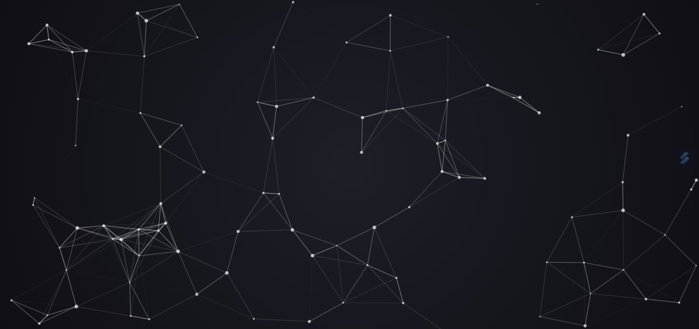
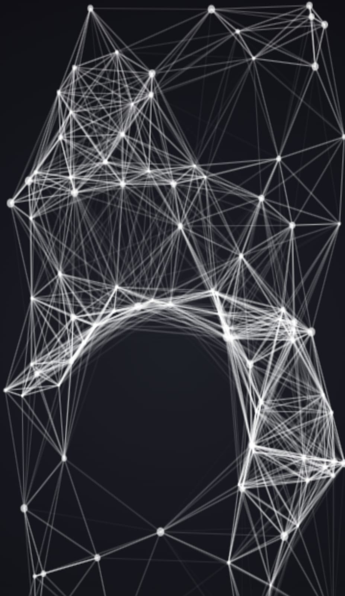

# 🎆 Animation de Particules Dynamiques 🎆

 

## 📜 Présentation

Bienvenue dans ce projet d'animation de particules interactives ! 🌟     
Ce projet vous plonge dans un univers visuel où des particules flottantes réagissent en temps réel aux mouvements de votre souris. Découvrez une expérience dynamique et immersive, idéale pour des fonds d'écran interactifs, des arrière-plans de sites web, ou simplement pour l'exploration créative.

 
 

## ✨ Fonctionnalités Principales  

🖱️Animation Interactive : Les particules réagissent aux mouvements de la souris en se déplaçant et en se connectant entre elles   
📱💻 Canvas Responsive : L'animation s'adapte à toutes les tailles d'écrans, qu'il s'agisse de bureau ou mobile   
🌌 Effets Visuels Évolués : Les particules se connectent avec des lignes subtiles lorsque la distance entre elles est réduite   
🚀 Optimisé pour la Performance : Animation fluide même avec un grand nombre de particules   

 
 

## 📸 Aperçu

Voici à quoi ressemble l'application :   

   

 

 
 

[Démo vidéo du projet sur ordinateur 🎥](https://www.youtube.com/watch?v=QzvBfGK7-gM)

[Démo vidéo du projet sur mobile 🎥](https://www.youtube.com/watch?v=UsBM3HTk-Ug)

 
 

## 🌐 Lien direct

Pour l'utiliser : [Animation-de-particules🎆](https://gabriellepagnard.github.io/Animation-de-particules/
)   

 
 

## 🔧 Technologies Utilisées

🖼️ HTML5 : Pour la structure de base   
🎨 CSS3 : Pour le style et l'arrière-plan en dégradé dynamique   
🧠 JavaScript : Pour la logique d'animation des particules   
🖌️ Canvas API : Pour le rendu graphique et l'interaction   

 
 

## 📂 Fichiers du Projet

- index.html : La structure HTML du projet   
- style.css : La feuille de style pour l'apparence et l'adaptation du canvas   
- app.js : Le script principal gérant l'animation des particules   
- ressources/ : Images, icônes, et autres ressources   

 
 

## 🛠️ Installation et Utilisation

Pour démarrer avec Animation de particules, suivez ces étapes simples :   

➡️ Clonez le Répertoire :   

`git clone https://github.com/votre-utilisateur/Animation-de-particules.git`   

➡️ Accédez au Répertoire :   

`cd Animation-de-particules`   

➡️ Ouvrez le Fichier "index.html" dans votre navigateur pour voir l'application en action   

➡️ Personnalisez le Code selon vos besoins ou apportez des contributions !   

 
 

## 🏗️ Comment Contribuer

Vous souhaitez contribuer ? 🎉 Voici comment faire :   

### Créer une Branche 🌿

➡️ Pour chaque nouvelle fonctionnalité ou correction, créez une nouvelle branche :   

`git checkout -b nom-de-la-branche`   

### Faire vos Changements ✏️   

Apportez les modifications nécessaires et committez-les :   

`git add .`   
`git commit -m "Description des changements"`   

### Pousser les Changements ⬆️   

Envoyez vos modifications à GitHub 📨 :

`git push origin nom-de-la-branche`   

### Créer une Pull Request 🔄   

Allez sur GitHub, ouvrez une Pull Request et expliquez vos modifications   

 
 

## 🤝 Contributeurs/trices

Gabrielle Pagnard 🧑‍💻 - Créatrice du projet

 
 

## 📧 Contact

Pour toute question ou suggestion, n'hésitez pas à me contacter :   

Email : gpagnard@gmail.com   
GitHub : [GabriellePagnard](https://github.com/GabriellePagnard)     

 
 
 

Merci d'avoir pris le temps de découvrir ce projet ! ✨    

 

Si vous avez apprécié ce travail ou trouvé ce projet utile, n'hésitez pas à laisser une ⭐ sur ce dépôt.   
Cela encourage énormément et motive à créer encore plus de projets sympas ! 🚀

 
 

Votre soutien compte vraiment, alors merci d'avance pour vos encouragements et vos retours ! 🎉